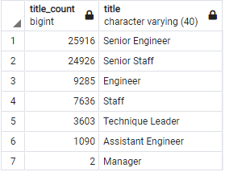
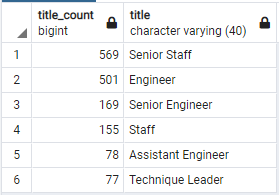

# Pewlett-Hackard-Analysis

## Table of Contents
- [Overview of Project](#OverviewProject)
  * [Purpose](#purpose)
- [Results](#Results)
  * [Retiring Employees](#retemp)
  * [Employees Eligible for Mentorship Program](#mentp)
- [Summary](#Summary)
- [Resources](#Resources)

## Overview of Project

A fictional company, Pewlett Hackard, needed an analysis performed on the employees that would soon be eligible for retirement. The data provided for the analysis included several csv files containing employee, department and management information [[7]](#7). The project required using postgress SQL, and pgAdmin in order to analyze tables, filter them and join tables in order to capture information from different sources. 

### Purpose

As part of this project we needed to respond to a few questions:

* Who is retiring in the near future?
* What jobs do the people retiring perform?
* How many people per job title are retiring?
* Who is eligible to participate in a mentorship program? 

We answered these questions using SQL queries [[1]](#1).

## Results

### Retiring Employees

In our first query we filtered the data to only include employees born between 1952 and 1955, with the assumption that those were employes of retiring age. We collected the titles and got 133, 776 results [[2]](#2).  Yet those results had duplicate employee numbers, as many empolyees had held different titles during their tenure in PH. 
...

        SELECT e.emp_no, e.first_name, e.last_name,
                ti.title, ti.from_date, ti.to_date
        INTO retirement_titles
        FROM employees AS e
        WHERE e.birth_date BETWEEN '1952-01-01' AND '1955-12-31'
        INNER JOIN titles AS ti
        ON e.emp_no = ti.emp_no
        ORDER BY e.emp_no;

...

In our second query we filtered the data to only current employees, and also made it so that only the latest title for each employee showed up [[3]](#3). Based on the records we got, we can conclude that a total of 72,458 current employees are of retiring age.  

...

        SELECT DISTINCT ON (rt.emp_no) 
        rt.emp_no,
                      rt.first_name, 
                      rt.last_name,
                      rt.title

       INTO unique_titles
       FROM retirement_titles AS rt
       WHERE rt.to_date = '9999-01-01'
       ORDER BY rt.emp_no, rt.to_date  DESC;
        
...

In our third query we got a count of the number of employees per title that would be retiring [[4]](#4). This data helps clarify where recruting and mentorship needs to focus. In this case we see that approximatey two thirds of the retiring employees are Senior Engineers or Senior Staff. 

...

       SELECT COUNT(ut.emp_no) AS title_count, ut.title
       INTO retiring_titles
       FROM unique_titles as ut
       GROUP BY ut.title
       ORDER BY title_count DESC;

...

  

 Figure 2: Retiring Employees Count per Title
 

### Employees Eligible for Mentorship Program

On our fourth query we gathered information on current employees born in 1965 as potential mentees of the soon to be retiring employees [[5]](#5). Only 1,549 employees meet the requirements previously stated. 
...

       SELECT DISTINCT ON (e.emp_no) 
        e.emp_no, e.first_name, e.last_name, e.birth_date,
               de.from_date, de.to_date,
               ti.title
       INTO mentorship_eligibility
       FROM employees AS e
       INNER JOIN dept_emp AS de
       ON e.emp_no = de.emp_no
       INNER JOIN titles AS ti
       ON e.emp_no = ti.emp_no
       WHERE (e.birth_date BETWEEN '1965-01-01' AND '1965-12-31')
               AND (de.to_date = '9999-01-01')
       ORDER BY e.emp_no;

...

Our last query focused on getting a count of the employees meeting the mentorship requirements per title to see how the eligible employees compare to the retiring employees by title. Since employees ready to be mentees only make up 2.14% of the total number of retiring employees, in general the count of mentees per title are small percentage compared to retiring employees count per title. Yet, Senior Engineers seem to be a title that percentage wise compromises less of the mentorship eligible employees and more of the retiring employees. 

...

       -- Potential Mentees by title
       SELECT COUNT(me.emp_no) AS title_count, me.title
       FROM mentorship_eligibility as me
       GROUP BY me.title
       ORDER BY title_count DESC;

...

  

 Figure 2: Mentorship Eligible Employees Count per Title
 

##  Summary

Based on our analysis we found that in Pewlett-Hackard 72,458 current employees are of retiring age and only 1,549 employees meet the given requirements to qualify for the mentorship program. Eligible employees only compromise 2.14% of the total number of retiring employees. It would be recommended to expand the age bracket for employees to be considered potential mentees. Pewlett-Hackard has 240,125 current employees, which means that 30.2% of employees are soon to retire. The company will need to do agressive recruiting and training programs, in particular with Senior Staff and Senior Engineering positions.   

## Resources

<a name="1">[1]</a> [SQL Query](https://github.com/tamiespinosa/Pewlett-Hackard-Analysis/blob/d22f8a1007d031e8301fd7e1d28459445a5d6f6f/Queries/Employee_Database_challenge.sql)

<a name="2">[2]</a> [Retirement Titles](https://github.com/tamiespinosa/Pewlett-Hackard-Analysis/blob/d22f8a1007d031e8301fd7e1d28459445a5d6f6f/Data/retirement_titles.csv)

<a name="3">[3]</a> [Unique Titles](https://github.com/tamiespinosa/Pewlett-Hackard-Analysis/blob/d22f8a1007d031e8301fd7e1d28459445a5d6f6f/Data/unique_titles.csv)

<a name="4">[4]</a> [Retiring Titles](https://github.com/tamiespinosa/Pewlett-Hackard-Analysis/blob/d22f8a1007d031e8301fd7e1d28459445a5d6f6f/Data/retiring_titles.csv)

<a name="5">[5]</a> [Membership Program](https://github.com/tamiespinosa/Pewlett-Hackard-Analysis/blob/d22f8a1007d031e8301fd7e1d28459445a5d6f6f/Data/mentorship_eligibility.csv)

<a name="6">[6]</a> [Data](https://github.com/tamiespinosa/Pewlett-Hackard-Analysis/tree/main/Data)

[7] https://docs.github.com/en/get-started/writing-on-github/getting-started-with-writing-and-formatting-on-github/basic-writing-and-formatting-syntax
